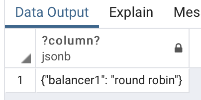

#Глава 3

###1) Попробуйте ввести в таблицу aircrafts строку с таким значением атрибута «Код самолета» (aircraft_code), которое вы уже вводили, например:

```sql
INSERT INTO aircrafts VALUES ('SU9','Sukhoi SuperJet-100',3000);
```


**Ответ:**

**Так как aircraft_code является первичным ключом, он обязан быть уникальный, а поскольку мы ранее вносили в таблицу запись с аналогичным значением SU9, то запись не произойдет из-за ограничения уникальности ключа**


###2) Самостоятельно напишите команду для вы- борки всех строк из таблицы aircrafts, чтобы строки были упорядочены по убы- ванию значения атрибута «Максимальная дальность полета, км» (range).


###3)Самостоятельно напишите команду UPDATE полностью, при этом не забудьте, что увеличить дальность полета нужно только у одной моде- ли — Sukhoi SuperJet, поэтому необходимо использовать условие WHERE. 


```sql
UPDATE aircrafts SET range=range*2 WHERE aircraft_code='SU9'
```


###4) Самостоятельно смоделируйте описанную ситуацию, подобрав условие, кото- рому гарантированно не соответствует ни одна строка в таблице «Самолеты» (aircrafts).

```sql
DELETR FROM aircrafts WHERE aircraft_code=NULL
```


#Глава 4

###2)Теперь сделайте выборку из таблицы и посмотрите, что все эти разнообразные значения сохранены именно в том виде, как вы их вводили.


###4)При работе с числами типов real и double precision нужно помнить, что сравнение двух чисел с плавающей точкой на предмет равенства их значений может привести к неожиданным результатам. Например, сравним два очень маленьких числа (они представлены в экспоненциальной форме записи): 

```sql
SELECT '5e-324'::double precision > '4e-324'::double precision; 
```

###?column? ---------- f (1 строка) 

###Чтобы понять, почему так получается, выполните еще два запроса.

```sql
SELECT '5e-324'::double precision;
```

### float8 ----------------------- 4.94065645841247e-324 (1 строка)

```sql
 SELECT '4e-324'::double precision;
```

### float8 ----------------------- 4.94065645841247e-324 (1 строка) 

###Самостоятельно проведите аналогичные эксперименты с очень большими числами, находящимися на границе допустимого диапазона для чисел типов real и double precision.

```sql
SELECT '1223334444556677'::double precision > '1223334444556677'::double precision;
```


```sql
SELECT '7999993'::real > '7999992'::real;
```


###8)При выполнении этой команды СУБД выдаст сообщение об ошибке. Почему?

Поскольку если не задавать явно значение id, которое является первичным ключем с типом SERIAL при выполнении INSERT, то interger значение первичного ключа будет авто инкрементироваться с каждым вызовом с неявно заданным ключем ID, а так как ранее мы задали id в явном виде **2**, то при последующем вызове с неявным видом ID, автонкремент SERIAL продолжится со значения идущего до ранее заданного **2** и будет равен **2**, а так как первичный ключ с таким значением уже есть, то мы получсем ошибку, а при следующем вызове INSERT автоинкремент станет равным 3, и так как ранее мы не вносили запись с первичным ключем **3**, то запись пройдет успешно


###12)P.S: в моем postgres 9.5 стандартное значение datestyle - 'MDY'

```sql
SELECT '18-05-2016'::date;
```


```sql
SELECT '05-18-2016'::date;
```


```sql
SELECT '2016-05-18'::date;
```


```sql
SELECT '18-05-2016'::date;
```


```sql
SELECT '05-18-2016'::date;
```


###15)Приведем несколько команд, иллюстрирующих использование этой функции. Ее первым параметром является форматируемое значение, а вторым — шаблон, описывающий формат, в котором это значение будет представлено при вводе или выводе. Сначала попробуйте разобраться, не обращаясь к документации, в том, что означает второй параметр этой функции в каждой из приведенных команд, а затем проверьте свои предположения по документации.

```sql
SELECT to_char( current_timestamp, 'mi:ss' );
```


```sql
SELECT to_char( current_timestamp, 'dd' );
```


```sql
SELECT to_char( current_timestamp, 'yyyy-mm-dd' );
```


###21)Можно с высокой степенью уверенности предположить, что при прибавлении интерваловкдатамивременны ́мотметкамPostgreSQLучитываеттотфакт, что различные месяцы имеют различное число дней. Но как это реализуется на практике? Например, что получится при прибавлении интервала в 1 месяц к последнему дню января и к последнему дню февраля? Сначала сделайте обос- нованные предположения о результатах следующих двух команд, а затем про- верьте предположения на практике и проанализируйте полученные результаты:

```sql
SELECT ( '2016-01-31'::date + '1 mon'::interval ) AS new_date;
```


###									

```sql
SELECT ( '2016-02-29'::date + '1 mon'::interval ) AS new_date;
```


###30)Обратимся к таблице, создаваемой с помощью команды

```sql
CREATE TABLE test_bool ( a boolean,
b text );
```

Как вы думаете, какие из приведенных ниже команд содержат ошибку?

Ответ:

```sql
INSERT INTO test_bool VALUES ( yes, 'yes' );
```

И

```sql
INSERT INTO test_bool VALUES ( 1, 'true' );
```


###33)В разделе документации 8.15 «Массивы» сказано, что массивы могут быть мно- гомерными и в них могут содержаться значения любых типов. Давайте сначала рассмотрим одномерные массивы *текстовых* значений.

Предположим, что пилоты авиакомпании имеют возможность высказывать свои пожелания насчет конкретных блюд, из которых должен состоять их обед во время полета. Для учета пожеланий пилотов необходимо модифицировать таблицу pilots, с которой мы работали в разделе 4.5.

```sql
CREATE TABLE pilots ( pilot_name text,
       schedule integer[],
       meal text[]
     );

```

**Так как таблица *Pilots* уже была создана, создадим аналогичную таблицу *Pilots1* **

```sql
CREATE TABLE pilots1 ( pilot_name text,
       schedule integer[],
       meal text[]
     );

```

```sql
SELECT * FROM pilots;
```


```sql
SELECT * FROM pilots WHERE meal[ 1 ] = 'сосиска';
```


Создадим таблицу ***Pilots2***

```sql
CREATE TABLE pilots2 ( pilot_name text,
	schedule integer[],
	meal text[][]
);

```

Проведем несколько выборок:

```sql
SELECT * FROM pilots2;
```


Добавим несколько записей и повторим выборку:


###35)Изучая приемы работы с типами JSON, можно, как и в случае с массивами, пользоваться способностью команды SELECT обходиться без создания таблиц.

Покажем лишь один пример. Добавить новый ключ и соответствующее ему зна- чения в уже существующий объект можно оператором ||:

```sql
SELECT '{"balancer1":"round robin","balancer2":"least connections","balancer3":"least traffic"}'::jsonb
```


```sql
SELECT '{"balancer1":"round robin","balancer2":"least connections","balancer3":"least traffic"}'::jsonb->'balancer1'
```


```sql
SELECT '[{"balancer1":"round robin"},{"balancer2":"least connections"},{"balancer3":"least traffic"}]'::jsonb->0
```



