# Глава 5

### 2)Посмотрите, какие ограничения уже наложены на атрибуты таблицы «Успеваемость» (progress). Воспользуйтесь командой \d утилиты psql. А теперь предложите для этой таблицы ограничение уровня таблицы.
```sql
CONSTRAINT valid_mark CHECK ( mark >= 3 AND mark <= 5 )

CONSTRAINT valid_term CHECK ( term = 1 OR term = 2 )
```

```sql
INSERT INTO progress VALUES(11111,'algebra','2019',1,4,'экзамен');
```

```sql
SELECT * FROM progress;
```

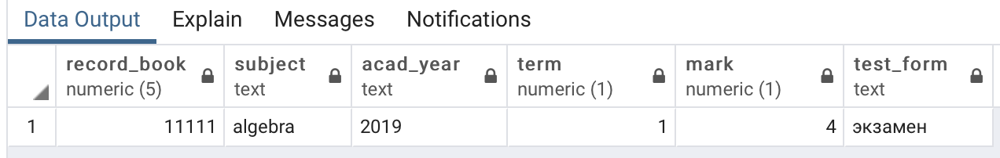

Возможно задать ограничение на атрибут acad_year, проверяющее текстовое поле на содержание года в верном формате.

```sql
CONSTRAINT valid_year CHECK ( acad_year = ‘2018’ OR acad_year = ‘2019’ )
```


###9)В таблице «Студенты» (students) есть текстовый атрибут name, на который на- ложено ограничение NOT NULL. Как вы думаете, что будет, если при вводе новой строки в эту таблицу дать атрибуту name в качестве значения пустую строку? ...

```sql
INSERT INTO students ( record_book, name, doc_ser, doc_num ) VALUES ( 12300, '', 123, 456 );
```

```sql
SELECT * FROM students;
```


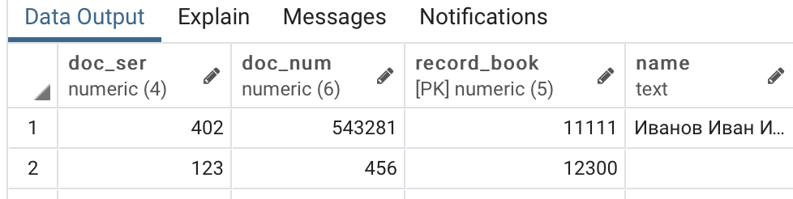


```sql
ALTER TABLE students ADD CHECK ( name <> '' );
```


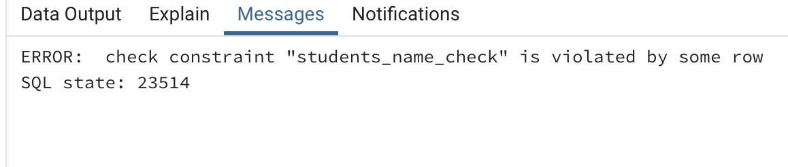


```sql

INSERT INTO students ( record_book, name, doc_ser, doc_num ) VALUES ( 12346, ' ', 0406, 112233 );
INSERT INTO students ( record_book, name, doc_ser, doc_num )VALUES ( 12347, '  ', 0407, 112234 );
SELECT * FROM students;
```

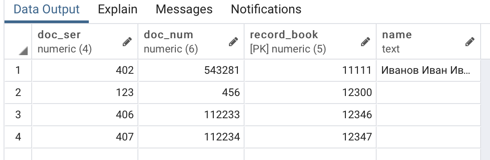


```sql
SELECT *, length( name ) FROM students;
```


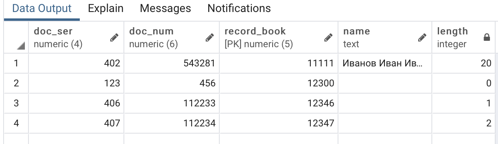


```sql
ALTER TABLE students ADD CHECK (name=btrim(name));
INSERT INTO students ( record_book, name, doc_ser, doc_num ) VALUES ( 12346, ' ', 0406, 112233 );


```

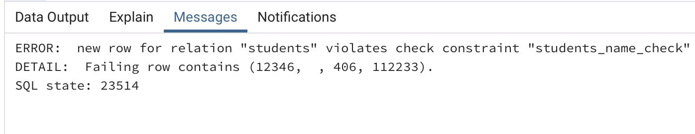

Есть ли подобные слабые места в таблице «Успеваемость» (progress)?

**Это атрибуты subject и acad_year**


### 17). Представления могут быть, условно говоря, вертикальными и горизонтальными. При создании вертикального представления в список его столбцов включается лишь часть столбцов базовой таблицы (таблиц). Например: CREATE VIEW airports_names AS SELECT airport_code, airport_name, city FROM airports; SELECT * FROM airports_names; В горизонтальное представление включаются не все строки базовой таблицы (таблиц), а производится их отбор с помощью фраз WHERE или HAVING. Например: CREATE VIEW siberian_airports AS SELECT * FROM airports WHERE city = 'Новосибирск' OR city = 'Кемерово'; SELECT * FROM siberian_airports; Конечно, вполне возможен и смешанный вариант, когда ограничивается как список столбцов, так и множество строк при создании представления. Подумайте, какие представления было бы целесообразно создать для нашей базы данных «Авиаперевозки». Необходимо учесть наличие различных групп пользователей, например: пилоты, диспетчеры, пассажиры, кассиры. Создайте представления и проверьте их в работе.

```SQL
CREATE VIEW dme_led AS SELECT * FRO  flights WHERE departure_airport = 'DME' AND arrival_airport = 'LED';
```

```sql
CREATE VIEW econ_319 AS SELECT seat_no FROM seats WHERE aircraft_code = '319' AND fare_conditions = 'Economy';
```


Представление всех мест эконом класса в самолете Airbus A319-100.


###18)Предположим,что нам понадобилось иметь в базе данных сведения о технических характеристиках самолетов, эксплуатируемых в авиакомпании. Пусть это будут такие сведения, как число членов экипажа (пилоты), тип двигателей и их количество. Следовательно, необходимо добавить новый столбец в таблицу «Самолеты» (aircrafts). Дадим ему имя specifications, а в качестве типа данных выбе- рем jsonb. Если впоследствии потребуется добавить и другие характеристики, то мы сможем это сделать, не модифицируя определение таблицы.

```sql
SELECT model, specifications FROM aircrafts
WHERE aircraft_code = '320';
```

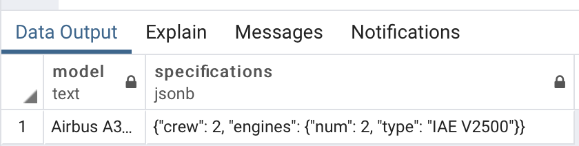


```sql
SELECT model, specifications->'engines' AS engines FROM aircrafts
WHERE aircraft_code = '320';
```

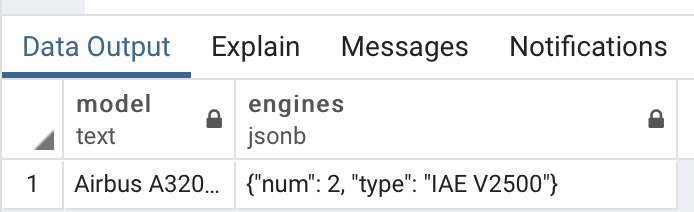


```sql
SELECT model, specifications #> '{ engines, type }' FROM aircrafts
WHERE aircraft_code = '320';
```

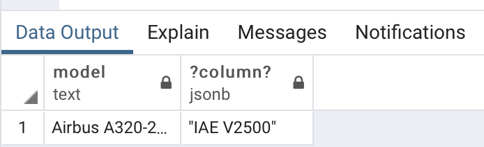


**Задание.** Подумайте, какие еще таблицы было бы целесообразно дополнить столбцами типа json/jsonb. Вспомните, что, например, в таблице «Билеты» (tickets) уже есть столбец такого типа — contact_data. Выполните модифи- кации таблиц и измените в них одну-две строки для проверки правильности ваших решений.

```sql
ALTER TABLE airports ADD COLUMN features jsonb;
UPDATE airports set features = '{"restaurants": 8, "shops": 26 , "wi-fi": true}' WHERE airport_code = ‘DME’;

```

Добавить в таблицу аэропортов краткое описание того, что есть в каждом аэропорту.


# Глава 6

###2)пассажиров с именами, состоящими из трех букв (в шаблоне присутствуют три символа «_»): SELECT passenger_name FROM tickets WHERE passenger_name LIKE '___ %'; Предложите шаблон поиска в операторе LIKE для выбора из этой таблицы всех пассажиров с фамилиями, состоящими из пяти букв.
```sql
SELECT passenger_name FROM tickets WHERE passenger_name LIKE '% _____';
```

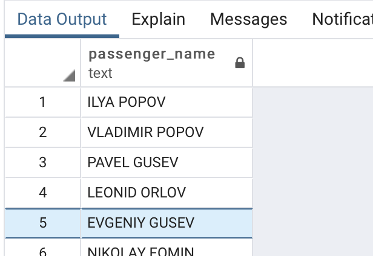

###  7)Самые крупные самолеты в нашей авиакомпании — это Boeing 777-300. Выяснить, между какими парами городов они летают, поможет запрос:

```sql
SELECT DISTINCT departure_city, arrival_city
FROM routes r
JOIN aircrafts a ON r.aircraft_code = a.aircraft_code
WHERE a.model = 'Boeing 777-300'
ORDER BY 1;
```

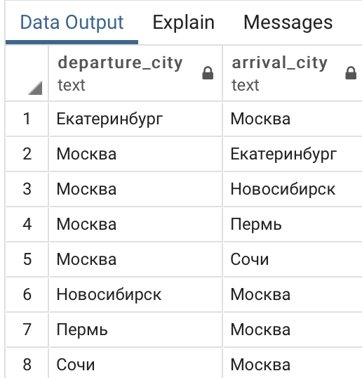

К сожалению, в этой выборке информация дублируется. Пары городов приведе- ны по два раза: для рейса «туда» и для рейса «обратно». Модифицируйте запрос таким образом, чтобы каждая пара городов была выведена только один раз:

```sql
SELECT DISTINCT least(departure_city, arrival_city) as departure_city, greatest(departure_city, arrival_city) as arrival_city
FROM routes r
JOIN aircrafts a ON r.aircraft_code = a.aircraft_code
WHERE a.model = 'Boeing 777-300'
GROUP BY 1,2 ORDER BY 1,2;

```

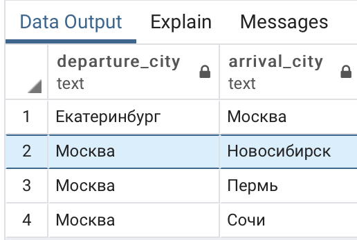

### 9)Для ответа на вопрос, сколько рейсов выполняется из Москвы в Санкт-Петербург, можно написать совсем простой запрос: SELECT count( * ) FROM routes WHERE departure_city = 'Москва' AND arrival_city = 'Санкт-Петербург';А с помощью какого запроса можно получить результат в таком виде? departure_city | arrival_city | count

```sql
SELECT departure_city,arrival_city,count( * ) FROM bookings.routes
WHERE departure_city = 'Москва' AND arrival_city= 'Санкт-Петербург' GROUP BY departure_city, arrival_city;
```


###13)А как выявить те направления, на которые не было продано ни одного билета? Один из вариантов решения такой: если на рейсы, отправляющиеся по какому- то направлению, не было продано ни одного билета, то максимальная и мини- мальная цены будут равны NULL. Нужно получить выборку в таком виде:

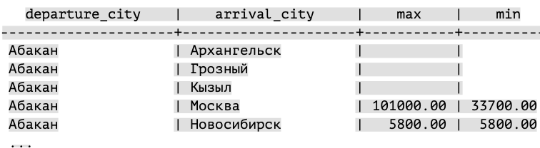

Ответ:

```sql
SELECT f.departure_city, f.arrival_city, max( tf.amount ), min( tf.amount ) 
FROM flights_v f LEFT JOIN ticket_flights tf 
ON f.flight_id = tf.flight_id 
GROUP BY 1, 2 ORDER BY 1, 2;

```


### 19)

### Задание 1.

Модифицируйте запрос, добавив в него столбец level (можно назвать его и iteration). Этот столбец должен содержать номер текущей итерации, поэтому нужно увеличивать его значение на единицу на каждом шаге. Не забудьте задать начальное значение для добавленного столбца в предложении VALUES. 

```sql
WITH RECURSIVE ranges ( min_sum, max_sum, iteration ) 
AS (
VALUES( 0, 100000, 1 ),( 100000, 200000, 1 ),( 200000, 300000, 1 )
UNION ALL
SELECT min_sum + 100000, max_sum + 100000, iteration + 1
FROM ranges
WHERE max_sum < ( SELECT max( total_amount ) FROM bookings )
)
SELECT * FROM ranges;

```

### Задаеие 2.

Для завершения экспериментов замените UNION ALL на UNION и выполните запрос. Сравните этот результат с предыдущим, когда мы использовали UNION ALL.

​								**UNION ALL**

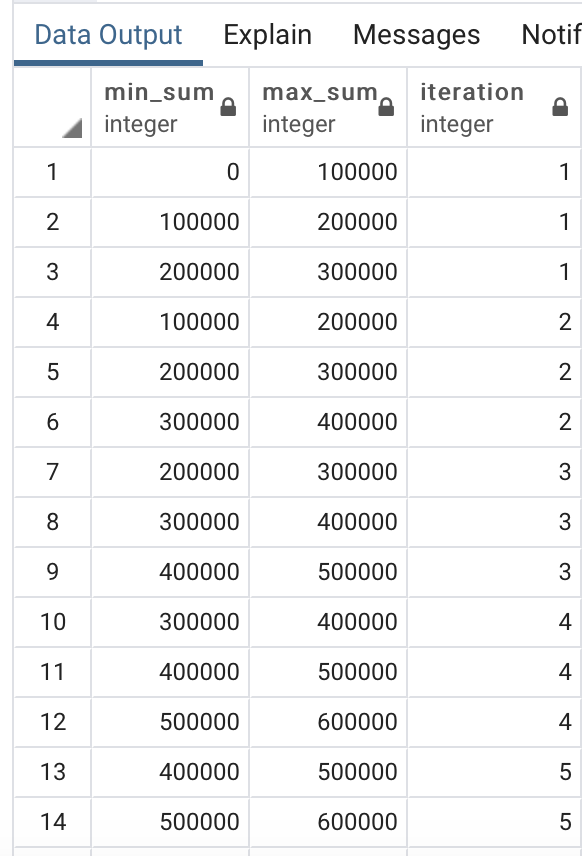

​							**UNION**


Отличий нет.


###21)В тексте главы был приведен запрос, выводящий список городов, в которые нет рейсов из Москвы.

```sql
SELECT DISTINCT a.city FROM airports a WHERE NOT EXISTS (

SELECT * FROM routes r
 WHERE r.departure_city = 'Москва'

AND r.arrival_city = a.city )

AND a.city <> 'Москва' ORDER BY city;
```


Можно предложить другой вариант, в котором используется одна из операций над множествами строк: объединение, пересечение или разность.

Вместо знака «?» поставьте в приведенном ниже запросе нужное ключевое сло- во — UNION, INTERSECT или EXCEPT — и обоснуйте ваше решение.

```sql
 SELECT city
      FROM airports
      WHERE city <> 'Москва'
?
SELECT arrival_city
FROM routes
WHERE departure_city = 'Москва' ORDER BY city;
```


Ответ:

```sql
SELECT city 
FROM airports 
WHERE city <> 'Москва' 
EXCEPT
SELECT arrival_city 
FROM routes 
WHERE departure_city = 'Москва' 
ORDER BY city;
---	Мы используем EXCEPT, чтобы исключить Москву из выборки, поскольку нам не нужны записи, где Москва - город вылета.

```


### 23)Предположим, что департамент развития нашей авиакомпании задался вопросом: каким будет общее число различных маршрутов, которые теоретически можно проложить между всеми городами? Если в каком-то городе имеется более одного аэропорта, то это учитывать не будем, т. е. маршрутом будем считать путь между городами, а не между аэропортами. Здесь мы используем соединение таблицы с самой собой на основе неравенства значений атрибутов. 

```sql
SELECT count( * ) FROM ( SELECT DISTINCT city FROM airports ) AS a1 JOIN ( SELECT DISTINCT city FROM airports ) AS a2 ON a1.city <> a2.city;
```


### Ответ:

```sql
WITH a AS (SELECT DISTINCT city FROM airports)
SELECT count(*) FROM a AS a1 JOIN a AS a2 ON a1.city <> a2.city;
```

